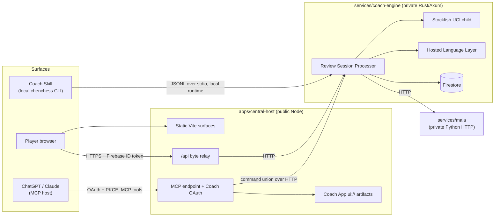
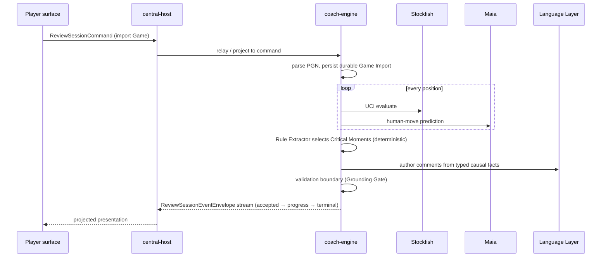

# System architecture

Living diagrams of the ChenChess system. Update the module doc when its
structure changes; vocabulary follows `CONTEXT.md` and decisions live in
`docs/adr/`.

- [coach-engine.md](coach-engine.md) — the Rust application service
- [central-host.md](central-host.md) — the public Node origin and MCP layer
- [maia.md](maia.md) — Maia-2 inference service
- [packages.md](packages.md) — shared packages and the generated contract

## One-screen overview



Three Player surfaces converge on one Rust service through one generated
command/event contract (`@chenchess/coach-engine-sdk`). Coach Engine is the
only writer of application Firestore data and the only place chess claims are
produced; every surface is a projection of its events.

## The grounded review pipeline



Chess truth comes only from engines and deterministic rules; the Language
Layer phrases prose over typed facts and its output is validated before
publication (ADR 0009, 0014, 0016).

## Repository layout

```text
/
├── apps/
│   ├── central-host/   # public Node origin: web app, MCP, OAuth, relay
├── services/
│   ├── coach-engine/   # Rust workspace: app crate + crates/{contract,pipeline}
│   └── maia/           # Python: Maia-2 position inference
├── packages/
│   ├── coach-engine-sdk/   # GENERATED contract (types, decoders, schema)
│   ├── review-projection/  # pure contract → presentation projection
│   ├── shared-assets/      # Canonical Game, grounding sentences, limits
│   └── ui/                 # host-neutral shared presentation layer
├── skills/chenchess-coach/ # Player-facing local Coach Skill
└── tooling/                # release gates, certification, repo checks
```

Boundary rule (`CODING_STANDARDS.md`): `apps/` and `services/`
never read each other; anything shared lives in `packages/` and is imported
from both sides.
