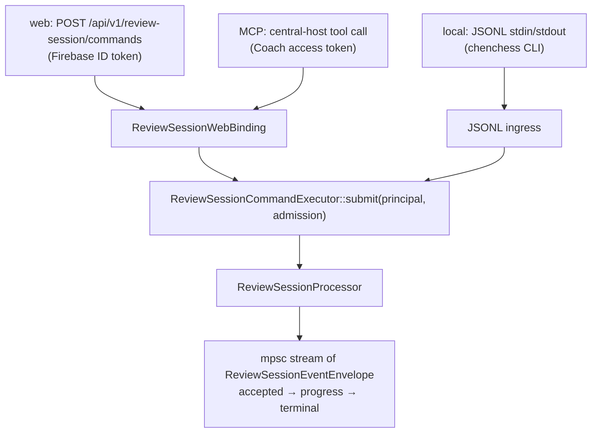

# coach-engine (services/coach-engine)

The private Rust/Axum application service. Owns identity verification, Game
Imports, transient Review Sessions, engine orchestration, the hosted Language
Layer, and all application Firestore data. Listens on `:8787`; only
central-host (and the local runtime) talk to it.

## Startup wiring (`src/main.rs`)

```text
main
  load_env + tracing (JSON logs)
  MaiaHttpAdapter::from_env        → ExactHumanMoveCache   (dyn HumanMoveModel)
  StockfishAdapter::from_env       → EngineWorkerLimit → ExactEngineCache (dyn EngineAnalyzer)
  configured_language_layer_runtime      # hosted LLM provider (pinned, ADR 0050/0051)
  configured_quality_capture_runtime     # feedback outbox exporter
  configured_account_deletion_runtime
  configured_beta_access_runtime
  build_review_session_executors(engine, human_model, language_layer)
    → daily_coaching_runtime.spawn_scheduler()
    → imported_games_runtime
    → ReviewSessionWebBinding(command executor)
  app(AppState) → axum::serve
```

Adapters are optional at startup (a build without Stockfish or Maia still
boots); capability checks happen per command. Every adapter is wrapped in an
exact-position cache and hidden behind a `dyn` trait, so tests substitute
recordings (ADR 0005).

## Module map

Three workspace crates. Old `crate::` paths keep working: the app crate
re-exports each extracted module under its original name (`pub use
coach_engine_contract as review_session_contract`, etc.).

```text
crates/contract/  (coach-engine-contract)
├── src/lib.rs                   # canonical command/event types → generates the SDK
├── src/lichess.rs               # Lichess URL grammar (parse only; transport stays app-side)
└── src/templates/               # TypeScript support files copied into the SDK
crates/pipeline/  (coach-engine-pipeline)
├── domain.rs                    # Game, EloProfile, ReviewSide, Player profiles
├── engine_analysis/             # StockfishAdapter (UCI child), caches, worker limit
├── human_move_model/            # MaiaHttpAdapter + cache
├── rule_extractor.rs            # deterministic Critical Moment selection
├── critical_moment_selector.rs  # candidate ranking
├── causal_facts.rs              # typed causal coaching facts (ADR 0016)
└── pgn/, position_phase.rs, evaluation_recording.rs, operating_limits.rs
src/  (chen-chess-coach-engine — app, HTTP surface, all bins)
├── lib.rs                       # Router: /health + merge of the per-domain routers
├── routes.rs                    # shared HTTP helpers; each routes/<domain>.rs owns
│                                #   its own router() next to its handlers
├── auth/                        # Firebase ID token + Coach access token verification
├── types.rs                     # AppState (re-exports pipeline domain types)
│
│   # Hosted authoring (Firestore-coupled, so not in the pipeline crate)
├── game_import*.rs, lichess*.rs, chess_com*.rs   # durable Game Imports
├── critical_moment_comment/     # hosted comment authoring over facts
├── language_layer_*             # prompt, provider, ledger, markers
├── review_validation.rs         # Grounding Gate: prose must match facts
├── learning_plan/, decision_*   # learning paths, decision explanations
│
│   # Review Session command surface
├── review_session_processor/    # admission, ingress, lifecycle, coaching, exploration…
├── review_session_transport.rs  # ReviewSessionCommandExecutor trait
│   ├── web.rs                   # ReviewSessionWebBinding (HTTP streaming)
│   └── jsonl.rs                 # JSONL ingress for the local Coach Skill
├── review_session_runtime.rs    # builds executors, shares stores
│
│   # Supporting domains
├── daily_coaching/              # digest pipeline, email delivery, scheduler
├── beta_access/                 # invitations, redemption, admission
├── account_deletion/            # Firebase + Firestore + OAuth cleanup
├── quality_capture/…            # feedback outbox (fingerprint-anchored)
├── firestore/                   # store implementations (in-memory twins for tests)
└── local_runtime/               # Coach Skill runtime manager (see below)
```

## Command flow



One command union, one event stream shape, regardless of surface. The
processor is keyed only by Player and Game Import — a Review Session is
transient with nothing to resume (ADR 0042).

## Local runtime (`src/local_runtime/` + `src/bin/chenchess.rs`)

The `chenchess` CLI installs and supervises a self-contained local pipeline
(ADR 0012, 0013): downloads a pinned Stockfish, runs Maia in a Docker
container, verifies a versioned `RuntimeManifest`, and drives Review Sessions
over the JSONL transport for the Coach Skill in `skills/chenchess-coach/`.
`gotham` subcommands maintain the evaluation corpus; `certification`
subcommands replay hosted journeys.

## Invariants

- Only engines and the Rule Extractor produce chess claims; the Language
  Layer phrases them and the Grounding Gate validates before publication.
- Firestore documents are written only here; central-host owns nothing but
  OAuth protocol records.
- `crates/contract/` is the single source of the wire contract —
  regenerate the SDK (`generate_review_session_contract`) after changing it.
