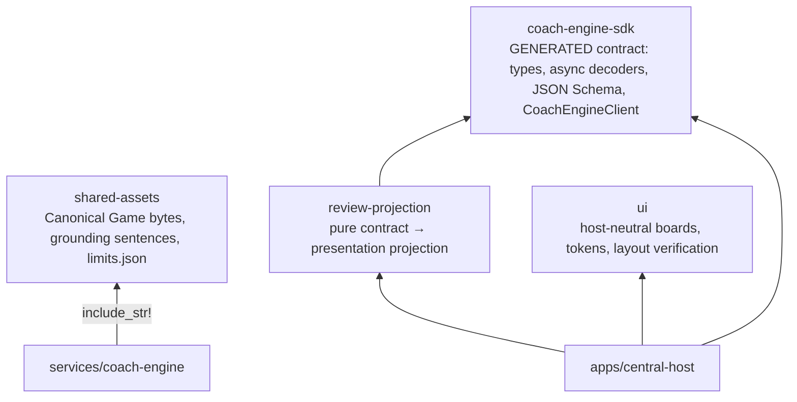

# Shared packages (packages/)

`apps/` and `services/` never read each other's source; everything shared
crosses through `packages/` (`CODING_STANDARDS.md`).

## Dependency direction

## coach-engine-sdk — the generated seam

Generated from `services/coach-engine/crates/contract/` by
`cargo run -p chen-chess-coach-engine --bin generate_review_session_contract`
(`--check` verifies without writing). Never edit by hand.

- `commands.json` proves every surface's inputs share one command union; `events.json` covers accepted, progress, and every terminal
  outcome.
- Decoders are async because they verify SHA-256 content digests (RFC 8785
  canonical JSON) before returning branded values.
- `CoachEngineClient` takes an auth-neutral async credential provider — a web
  adapter supplies a Firebase ID token, a protocol adapter a Coach access
  token; the SDK stores neither.

## review-projection

The one place a contract value becomes something a surface renders (moment
boards, move-sequence lines, player-visible SAN, snapshots). Pure functions
over SDK types + `chessops`; consumed by central-host and the fixture
generators so all surfaces render identically.

## shared-assets

Data only — no TypeScript harness code — because Coach Engine's Docker image
copies it for `include_str!`. Holds the Canonical Game (`fixtures/Synthet1`),
Grounding Gate sentences, and `limits.json` (shared numeric limits parsed on
both sides of the Rust/TS boundary).

## ui

Host-neutral presentation: board rendering, piece sprites, design tokens, and
motion. Layout and styling carry no automated gate: changes are reviewed from
screenshots, not asserted from measured geometry.

This snapshot ships no Storybook and no layout sweep: the manual sweeps that
once measured stories and marketing pages went with it. Layout is reviewed from
screenshots.
