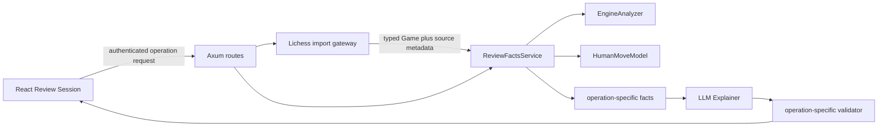

# Interactive review application seams

Status note: written 2026-07 during the Lichess interactive-review design, before the `apps/`/`services/` restructure. Retained as the record of that analysis; citations to `backend/` and `frontend/` paths are marked historical inline.

## Overview

The current architecture can support Lichess URL import and an intent-aware Review Session without creating a second chess-analysis pipeline. `ReviewFactsService` is the shared deterministic application seam: it owns position analysis through the existing engine and human-move interfaces, then hands their evidence to the Rule Extractor. Today its public operations accept PGN and parse it internally, but its private analysis already works on a typed `Game` and individual positions ([review_facts.rs](../../services/coach-engine/src/review_facts.rs#L43-L63), [review_facts.rs](../../services/coach-engine/src/review_facts.rs#L114-L150)).

The recommended change is to parse every external representation once, then use a typed `Game` for all downstream chess work. Lichess fetching belongs in a separate external-service gateway behind an authenticated ChenChess route. It is not a Model Adapter. The existing Model Adapters should remain position-in, evidence-out interfaces for Stockfish and Maia ([engine_analysis.rs](../../services/coach-engine/src/engine_analysis.rs#L12-L50), [human_move_model.rs](../../services/coach-engine/src/human_move_model.rs#L8-L39)).

React should own the ephemeral learning workflow. The Review Engine should own legal positions, chess evidence, fact construction, prose grounding, and validation. This split matches the v1 decision that Review Session state is not persisted ([map.md` (historical; the source map was scratch and has been removed)).

The import edge runs once when the source is a Lichess URL. Later Review Session operations reuse the same conceptual `Game`; whether v1 resends and reparses its PGN or introduces a short-lived server reference remains a route-contract decision.

## Current flow

The browser sends an authenticated `AnalyzeGameRequest` containing source, raw PGN, Elo Profile, model, and Explanation Style (`src/lib/api.ts` (historical; the `frontend/` tree predates the apps/ restructure)). Axum deserializes that JSON and requires `AuthenticatedPlayer` on both review routes ([routes.rs](../../services/coach-engine/src/routes.rs#L20-L49)); the extractor validates the bearer token and derives the Player ID from `sub` ([auth.rs](../../services/coach-engine/src/auth.rs#L70-L94)).

`game_review::run` creates `ReviewFactsService`, asks it to parse and review the PGN, sends the resulting `RuleExtraction` to the LLM Explainer, and returns facts plus prose (`src/App.tsx` (historical; the `frontend/` tree predates the apps/ restructure), `src/App.tsx` (historical; the `frontend/` tree predates the apps/ restructure)).

PGN parsing produces the useful internal representation already needed by interactive review. Each `ImportedMove` records ply, side, SAN, UCI, and the FEN before the move ([types.rs](../../services/coach-engine/src/types.rs#L150-L159)); `parse_pgn` derives those fields while applying each legal move ([pgn.rs](../../services/coach-engine/src/pgn.rs#L63-L112)). This is enough to reconstruct a Critical Moment and test one legal alternative without exposing board state to the browser.

There are three current limitations worth treating as facts, not design choices:

- The web path hardcodes `ReviewSide::Both` ([game_review.rs` (historical; `backend/src/game_review.rs` predates the services/ restructure)). ADR 0011 explicitly says this preserves existing web behavior, while side-aware review is already part of the domain ([ADR 0011](../adr/0011-scope-critical-moments-by-review-side.md#L1-L3)).
- `analysisId` is a fresh UUID added to each response. No store or lookup consumes it, so it is not a Review Session handle ([game_review.rs` (historical; `backend/src/game_review.rs` predates the services/ restructure), [game_review.rs` (historical; `backend/src/game_review.rs` predates the services/ restructure)).
- `ReviewableMove` intentionally exposes only ply, move number, side, and SAN. It omits FEN and UCI ([types.rs](../../services/coach-engine/src/types.rs#L161-L179)). Alternative Move requests therefore cannot rely on the current response to carry authoritative position data.

## Ownership and placement decisions

These are the recommended seams.

| Concern                                      | Owner                                                                             | Reason                                                                                                                                                                                                                  |
| -------------------------------------------- | --------------------------------------------------------------------------------- | ----------------------------------------------------------------------------------------------------------------------------------------------------------------------------------------------------------------------- |
| Lichess URL syntax and export JSON           | Review Engine boundary module and Lichess gateway                                 | Treat URL and remote JSON as untrusted input; never let an arbitrary URL reach the HTTP client.                                                                                                                         |
| Completed standard-game eligibility          | Lichess import application service                                                | The export endpoint also returns ongoing games and variants, while ordinary PGN parsing does not enforce the product boundary ([Lichess research](lichess-data-and-url-contracts.md#completed-standard-game-boundary)). |
| Typed game and position lookup               | Review Engine application core                                                    | `Game` and `ImportedMove` already contain legal moves and pre-move FENs.                                                                                                                                                |
| Engine and human evidence                    | Existing Model Adapters through `ReviewFactsService`                              | Their contracts already accept a position and return typed evidence.                                                                                                                                                    |
| Opening identification and Practice matching | Deterministic import and fact layers                                              | These claims must be sourced or selected before prose generation.                                                                                                                                                       |
| Move Intent text and Review Session step     | React state, with normalized request DTOs in Rust                                 | Intent is Player input and the step sequence is ephemeral. React must not manufacture chess facts.                                                                                                                      |
| Intent and Alternative Move facts            | New operation-specific outputs from `ReviewFactsService` and Rule Extractor logic | Avoid duplicating orchestration and avoid optional fields on full-game facts.                                                                                                                                           |
| Coaching prose                               | LLM Explainer                                                                     | The language layer explains supplied facts; it does not discover chess claims.                                                                                                                                          |
| Response acceptance                          | Operation-specific Review Engine validators                                       | Each operation has different required claims and identity invariants.                                                                                                                                                   |

## Lichess Game URL Import

Add a dedicated URL-import request rather than overloading `source + pgn`. The authenticated ChenChess route should accept the URL and coaching preferences, parse the URL into a value such as `LichessGameRef { game_id, review_side_hint }`, then call a `LichessGameGateway` with the eight-character ID. The gateway should construct the fixed `https://lichess.org/game/export/{id}` URL itself and deserialize the response into a narrow Serde DTO. It should never fetch the Player-supplied URL directly.

The outbound export call is anonymous, but the ChenChess route remains protected by `AuthenticatedPlayer`, like every existing review operation. Lichess documents anonymous single-game export, and one JSON response can include eligibility fields, opening data, and PGN ([Lichess research](lichess-data-and-url-contracts.md#single-game-export)). Calling this component a Model Adapter would blur the repository's accepted meaning of adapters as boundaries around chess engines and models ([ADR 0005](../adr/0005-adapters-for-chess-engines-and-models.md#L1-L3)).

After the gateway validates a completed standard game, parse its PGN once into `Game`. Downstream review operations should accept `&Game` or an owned `Game`, not raw URL, export JSON, or PGN. This likely means extracting `ReviewFactsService::review_game` and `review_moment` variants that take typed games, then leaving thin PGN entry points for the CLI and current web compatibility. Do not maintain two analysis implementations.

The side suffix belongs to import metadata and should populate `ReviewSide`. A bare URL requires an explicit White or Black choice. The suffix is an orientation hint, not proof of Player identity ([Lichess research](lichess-data-and-url-contracts.md#game-urls-and-review-side)).

## Opening and Practice context

Opening identification can enter through the documented game export response. The current `Game` retains only White, Black, Event, Site, Result, moves, and final-state fields ([types.rs](../../services/coach-engine/src/types.rs#L114-L137)); it has no ECO or opening-name field. The import contract must decide whether source metadata extends `Game` or travels beside it in a typed imported-game envelope. Either choice is acceptable if downstream code sees typed data rather than raw Lichess JSON.

Do not call Opening Explorer anonymously. As of March 2026 it requires OAuth, which is out of scope for this map. Export-provided ECO and opening name can support v1 identification without opening statistics ([Lichess research](lichess-data-and-url-contracts.md#authentication-is-now-mandatory)). If authenticated Explorer enrichment is reconsidered later, add another external-data gateway and a fact type whose names say “frequency” and “outcomes,” never “quality” or “best move.”

Practice matching should be deterministic. Lichess has no documented Practice discovery or semantic-matching API. A safe v1 seam is a reviewed, versioned allowlist from ChenChess teaching-theme identifiers to canonical Practice URLs. The Rule Extractor supplies the theme; a matcher returns zero or one link; the LLM may explain why the link fits but must not choose or invent it. The recommendation must remain optional because broken links and unmatched themes cannot fail a Game Review ([Lichess research](lichess-data-and-url-contracts.md#what-is-missing)).

## Move Intent and Intent Assessment

React should keep the Player's draft and submitted Move Intent in a discriminated Review Session state. The request to the Review Engine should identify the Game, moment ply, considered move, normalized intent text, Elo Profile, and Explanation Style. Empty or skipped intent must be a distinct state, not an invented sentence.

The Review Engine should return an operation-specific `IntentAssessmentFacts` packet. It should preserve the Player's exact intent, the interpreted intent presented for confirmation, the original move identity, objective consequences, and the evidence needed to distinguish these questions:

1. Does the plan fit the position?
2. Does the considered move execute that plan safely?

The language model can interpret and explain the Player's prose, but every chess claim in the assessment must come from the new fact packet. If materially different interpretations remain, the operation should return a clarification result rather than an assessment. This is a different response variant, not a partly empty assessment.

Do not append nullable `moveIntent`, `planFit`, and `executionFit` fields to `RuleExtraction`. Full-game review, selected-moment review, intent clarification, intent assessment, and Alternative Move assessment have different invariants. Separate fact types and separate draft validators make those invariants executable.

## Alternative Move analysis

Alternative Move analysis belongs in `ReviewFactsService` because the required work is another deterministic position analysis. Given a typed `Game` and moment ply, the Review Engine can find the pre-move FEN in `ImportedMove.position`, parse and validate the Player's candidate move against that position, apply it, and analyze the resulting position. The existing engine result already contains the strongest move and principal variation ([engine_analysis.rs](../../services/coach-engine/src/engine_analysis.rs#L17-L24)). The first move from analysis after the alternative is the opponent's strongest reply; the Review Engine should still represent and validate it explicitly in the new facts.

The service can compare:

- objective quality using engine evidence for the original move, alternative, and preferred move;
- intent fit using the confirmed Move Intent plus the deterministic consequences;
- practical fit using the Elo-aware Human Move Model evidence before and after the alternative.

No adapter needs a Review Session concept. Stockfish still receives a FEN. Maia still receives a FEN, Elo Profile, and candidate limit. The operation layer combines their evidence. The Review Engine remains the authority for move legality and position transitions even if a future board widget performs optimistic client-side checks.

The route should not accept client-supplied FEN. `ReviewableMove` omits it for good reason, and trusting it would let the browser detach evidence from the imported Game. Use the Game plus selected ply as the position identity.

## Review Session state

The current frontend already stores an `AnalysisSession` containing the request and response and uses a request-version ref to ignore stale selected-moment responses (`src/App.tsx` (historical; the `frontend/` tree predates the apps/ restructure), `src/App.tsx` (historical; the `frontend/` tree predates the apps/ restructure)). Extend that pattern into a reducer or equivalent discriminated state machine for “position hidden verdict,” intent draft, clarification, revealed assessment, alternative attempt, and reset. Keep attempts in memory and discard them when the Game changes or the page closes.

React may own selected ply, board orientation, text drafts, reveal state, loading state, and attempt history. It must not own legal FEN derivation, engine scores, strongest replies, opening claims, teaching-theme matches, or assessment verdicts. New network routes must remain inside the authenticated workspace and use bearer tokens exactly as the current routes do.

`analysisId` cannot identify this state today. If v1 avoids server persistence, the simplest contract is to resend the canonical PGN or URL-derived import payload plus selected ply for each operation, as selected-moment review already resends PGN. A short-lived server cache may reduce repeated parsing and Lichess calls, but that would introduce a new opaque session reference and lifecycle contract. The operating-limits ticket should decide whether measured cost justifies it.

## API and TypeScript boundaries

Use operation-specific request and response types at both HTTP boundaries. Rust Serde should parse URL-import JSON, Lichess export JSON, Move Intent requests, and Alternative Move requests once. LLM prose should likewise be parsed once into a typed draft at the LLM boundary and passed inward only after validation.

The frontend currently tells TypeScript to trust response JSON through casts. Error bodies use `as { error?: string }`, and successful bodies use `response.json() as Promise<ResponseBody>` (`src/lib/api.ts` (historical; the `frontend/` tree predates the apps/ restructure)). That gives no runtime guarantee. Each new endpoint should parse `unknown` with an operation-specific runtime decoder. The implementation-route ticket should decide whether to introduce a schema library or use small hand-written parsers, but widening the existing generic cast would weaken the boundary.

Prefer explicit response unions such as clarification versus assessment and success versus unavailable enrichment. Avoid one response with many optional fields. The same rule applies in Rust and TypeScript.

## Fact schemas, LLM, and Review Validator

ADR 0009 is binding: the Rule Extractor packet is the LLM Explainer's only source of chess claims, and the Review Engine rejects prose that does not match the expected plies ([ADR 0009](../adr/0009-llm-explainer-fact-boundary.md#L7-L13)). Current code implements separate draft types for full-game and selected-moment prose ([review_validation.rs](../../services/coach-engine/src/review_validation.rs#L7-L23)) and validates their distinct ply invariants ([review_validation.rs](../../services/coach-engine/src/review_validation.rs#L47-L93)). Interactive operations should copy that shape, not bypass it.

Add narrow fact packets and narrow draft types for intent clarification, Intent Assessment, and Alternative Move Assessment. Their validators should check at least:

- game moment and move identity match the request facts;
- every quoted SAN/UCI move, ply, evaluation, and reply matches deterministic evidence;
- Intent Assessment contains separate plan-fit and move-execution conclusions;
- Alternative Move Assessment contains separate objective, intent, and practical comparisons;
- skipped intent produces no attributed plan;
- Opening Identification and Practice links appear only when present in their source facts.

The current LLM path already serializes typed facts, instructs the model not to invent chess claims, parses JSON, and validates the result ([llm.rs` (historical; `backend/src/llm.rs` predates the services/ restructure), [llm.rs` (historical; `backend/src/llm.rs` predates the services/ restructure)). Add new explainer operations beside those methods. Do not create a general chat endpoint, and do not ask the LLM to query Lichess, run an engine, infer legality, or choose a Practice URL.

## File map

Likely implementation ownership, subject to the later implementation-route decision:

- `backend/src/lichess.rs` or `backend/src/lichess_import.rs`: URL parser, export DTO, fixed-origin client, eligibility errors, source metadata.
- `backend/src/types.rs`: shared imported-game and Review Side types. Keep HTTP DTOs out if they grow beyond the current file's scope.
- `backend/src/review_facts.rs`: typed-`Game` entry points plus intent and alternative deterministic operations.
- `backend/src/rule_extractor.rs`: operation-specific fact construction and teaching-theme identifiers.
- `backend/src/game_review.rs`: authenticated use-case orchestration across facts, explainer, and response assembly.
- `backend/src/review_validation.rs`: new draft structures and invariant checks.
- `backend/src/llm.rs`: narrow explainer methods that accept only typed facts.
- `backend/src/routes.rs` and `backend/src/lib.rs`: authenticated HTTP handlers and route registration.
- `frontend/src/lib/api.ts`: request methods plus runtime response parsing.
- `frontend/src/App.tsx`: import selection and ephemeral Review Session workflow. The component is already large enough that the implementation should likely extract a Review Session component and reducer, but this research does not decide that file split.

## Gotchas

- `ImportSource` currently does not dispatch import behavior. The orchestrator reads `pgn` regardless of source; routes only log the enum ([types.rs](../../services/coach-engine/src/types.rs#L19-L43), [game_review.rs` (historical; `backend/src/game_review.rs` predates the services/ restructure)). URL import needs a real import operation, not another source label.
- `parse_pgn` accepts legal nonterminal PGN and records `is_terminal`; completed-standard eligibility must happen at the Lichess boundary, not be inferred from successful parsing ([pgn.rs](../../services/coach-engine/src/pgn.rs#L99-L112)).
- A `/white` or `/black` suffix is Review Side input, not identity proof. Do not compare it to auth identity or Lichess usernames.
- Do not log a 12-character Lichess full ID. The last four characters are capability-bearing; reject it and ask for a public share URL ([Lichess research](lichess-data-and-url-contracts.md#public-game-page-forms)).
- Opening popularity and outcomes are descriptive. They cannot override Stockfish or turn a rare move into a mistake.
- Practice links are optional enrichment. Their failure cannot fail import, analysis, or Review Session operations.
- Client cancellation and stale-response suppression matter more once Alternative Move attempts can be repeated. Preserve the current request-version behavior or use abortable requests.

## Decisions still required

This investigation locates the seams but does not settle these contracts:

1. The exact accepted terminal Lichess statuses and user-facing import errors.
2. Whether v1 enrichment stops at export-provided opening identification, as the no-OAuth scope suggests.
3. Whether source metadata extends `Game` or sits in an imported-game envelope.
4. Whether interactive requests resend PGN, use the original Lichess URL, or receive a short-lived opaque import reference. `analysisId` cannot be reused without new server state.
5. The exact deterministic evidence and response union for intent clarification and assessment.
6. The Alternative Move request notation, latency budget, cancellation policy, and whether Maia runs after every attempt.
7. The teaching-theme vocabulary and reviewed Lichess Practice allowlist.
8. The frontend runtime-decoding approach and Review Session component split.

Those decisions belong to the remaining Wayfinder tickets. The architectural route itself is clear: one typed Game, one shared deterministic facts service, operation-specific fact and validator contracts, a separate Lichess gateway, and ephemeral React workflow state.
